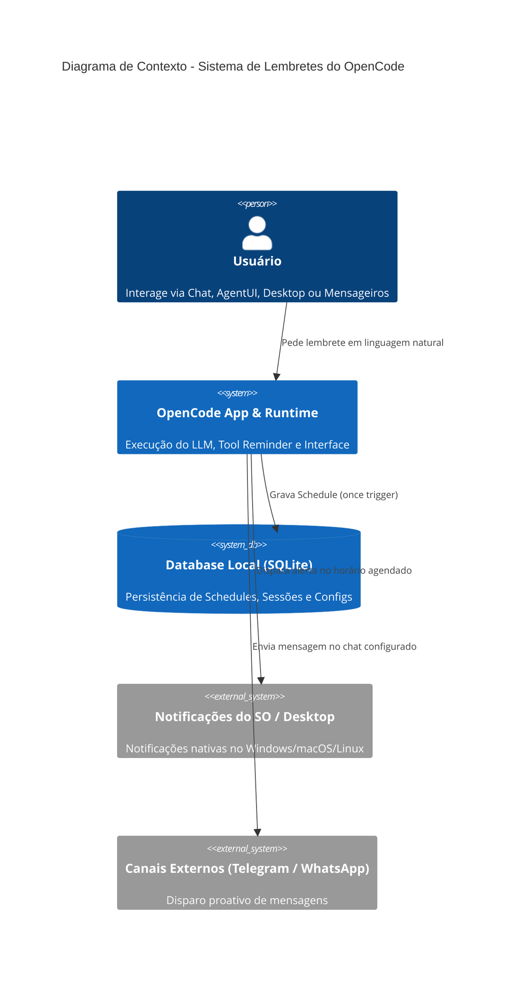

# ADD 0004: Sistema de Agenda, Lembretes Antecipados e Notificações no OpenCode (AgentUI & Chat)

## 1. Visão Geral & Contexto de Negócio

O objetivo desta arquitetura é permitir que usuários interajam conversacionalmente com agentes (no Chat principal do OpenCode ou através de instâncias de **AgentUI** conectadas a Desktop, Telegram ou WhatsApp) e solicitem o agendamento de lembretes pontuais com suporte a alertas antecipados (ex.: "me lembre no dia 15/10 às 14:00 e me avise 1 dia antes").

A infraestrutura subjacente de rotinas (`packages/core/src/schedule/` e `@opencode-ai/schema/schedule`) suporta disparos periódicos (`cron`, `interval`). Esta arquitetura estende o modelo para suportar disparos pontuais (`once`) e introduz uma tool dedicada de alta ergonomia para LLMs (`reminder`), enquanto mantém a tool administrativa `routine` com capacidades completas de CRUD.

---

## 2. Decisões Arquiteturais e Padrões (ADR Resumido)

### Decisão 1: Tool Especializada `reminder` vs Tool `routine` (Abordagem em Camadas)
- **Escolha:** Implementação de uma tool dedicada `reminder` voltada para linguagem natural e datas humanas, mantendo a tool `routine` para gerenciamento técnico de rotinas e scripts.
- **Motivação:** LLMs cometem menos erros de alucinação quando interagem com interfaces focadas. Em vez de exigir que o modelo calcule crons arbitrários e monte estruturas complexas de actions, a tool `reminder` recebe parâmetros semânticos (`targetDate`, `remindBefore`, `title`, `channels`) e o runtime decompõe isso nas rotinas correspondentes de forma segura e atômica.

### Decisão 2: Suporte a Gatilho de Disparo Único (`OnceTrigger`)
- **Escolha:** Adicionar `kind: "once"` com `timestamp: number` (epoch millis) em `@opencode-ai/schema/schedule`.
- **Comportamento:** O `ScheduleRunner` avalia itens `once` cujo `timestamp <= Date.now()` e que ainda não tenham sido executados (`lastRunAt === undefined`). Após o disparo bem-sucedido, o status é persistido e a rotina é desativada (`enabled: false`), garantindo idempotência e prevenindo re-disparos em caso de restart do daemon.

### Decisão 3: Notificação Multicanal & Injeção Conversacional
- **Canais Suportados:**
  1. **Desktop Native (OS Notification):** Notificação via Electron/Web Notification API com som e ação de clique que redireciona à sessão/agente correspondente.
  2. **AgentUI (Conversational Injection):** Injeção de mensagem proativa na sessão/chat de onde o lembrete foi originado ou no canal ativo (Telegram/WhatsApp).

---

## 3. Diagrama C4 & Fluxo de Dados



---

## 4. Contratos de Schema & Interfaces

### A. Schema de Schedule (`packages/schema/src/schedule.ts`)
```ts
// Trigger pontual para data/hora específica
export interface OnceTrigger extends Schema.Schema.Type<typeof OnceTrigger> {}
export const OnceTrigger = Schema.Struct({
  kind: Schema.Literal("once"),
  timestamp: Schema.Number, // Epoch millis UTC
}).annotate({ identifier: "Schedule.OnceTrigger" })

// Ação de Notificação de Lembrete
export interface ReminderAction extends Schema.Schema.Type<typeof ReminderAction> {}
export const ReminderAction = Schema.Struct({
  kind: Schema.Literal("reminder"),
  title: Schema.String,
  message: Schema.String,
  channels: optional(Schema.Array(Schema.Literals(["desktop", "agentui", "telegram", "whatsapp"]))),
  targetSessionId: optional(Schema.String),
  agentId: optional(Schema.String),
}).annotate({ identifier: "Schedule.ReminderAction" })
```

### B. Contrato da Tool `reminder` (`packages/opencode/src/tool/reminder.ts`)
```ts
export const Parameters = Schema.Struct({
  action: Schema.Literals(["create", "list", "cancel", "get"]),
  title: Schema.optional(Schema.String).annotate({ description: "Título claro do lembrete" }),
  targetDate: Schema.optional(Schema.String).annotate({ 
    description: "Data/hora de disparo em ISO-8601 (ex: '2026-10-15T14:00:00Z') ou formato local YYYY-MM-DD HH:mm:ss" 
  }),
  remindBefore: Schema.optional(Schema.Literals(["none", "15m", "1h", "2h", "1d", "2d"])).annotate({
    description: "Alerta antecipado opcional antes do horário principal"
  }),
  message: Schema.optional(Schema.String).annotate({ description: "Detalhes ou corpo da mensagem do lembrete" }),
  reminderId: Schema.optional(Schema.String).annotate({ description: "ID do lembrete (necessário para 'cancel' ou 'get')" }),
})
```

---

## 5. Mockup e Guia de Usuário (Visual & User Guide Gates)

- **Mockup Vetorial:** `design-system/mockups/agenda-reminders-mockup.svg`
- **Manual do Usuário:** `docs/userguide/agenda-reminders.md`

Ambos os artefatos estruturam o layout da nova aba/modal na interface gráfica de Agenda e detalham as regras de negócio, permissões e fluxos de exceção.
